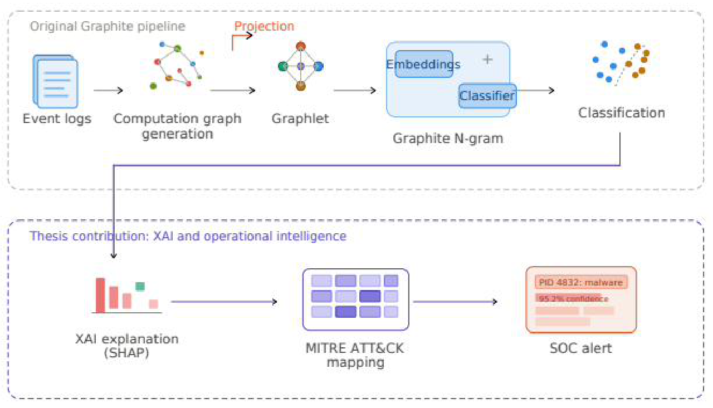
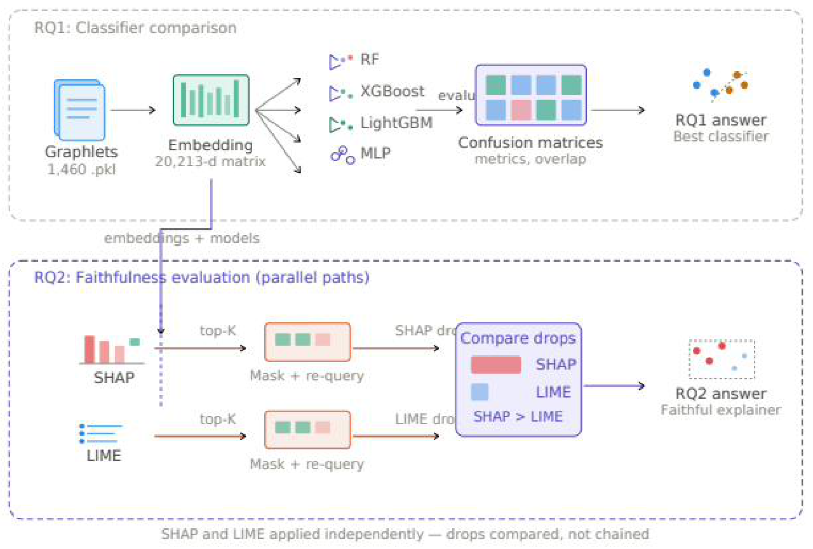
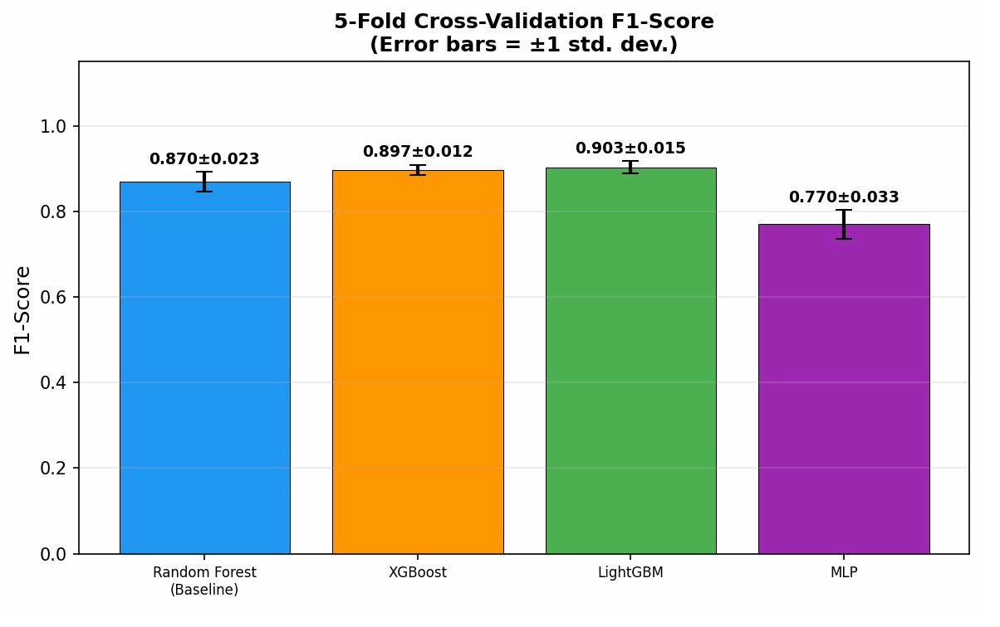
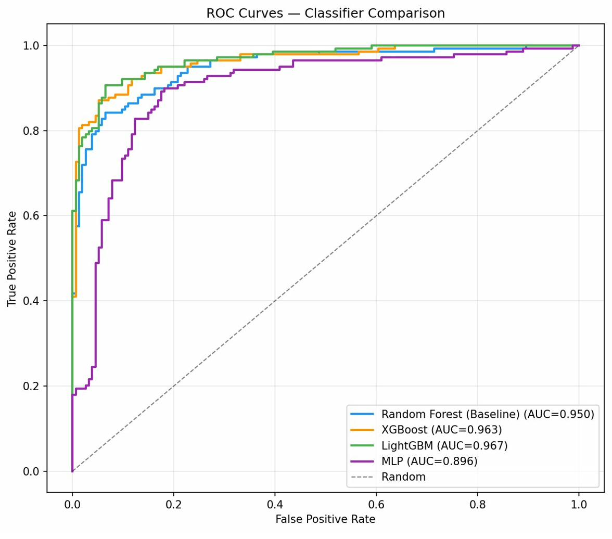
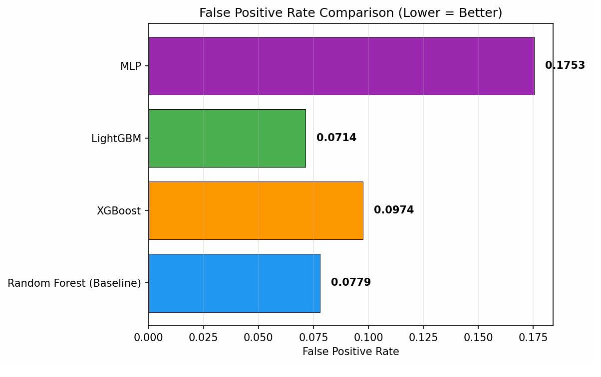
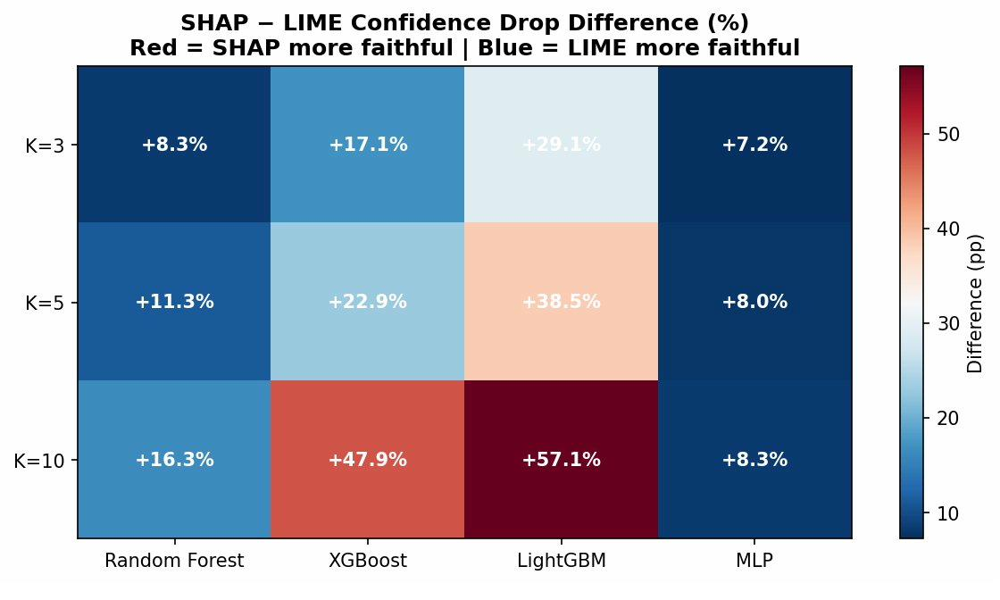
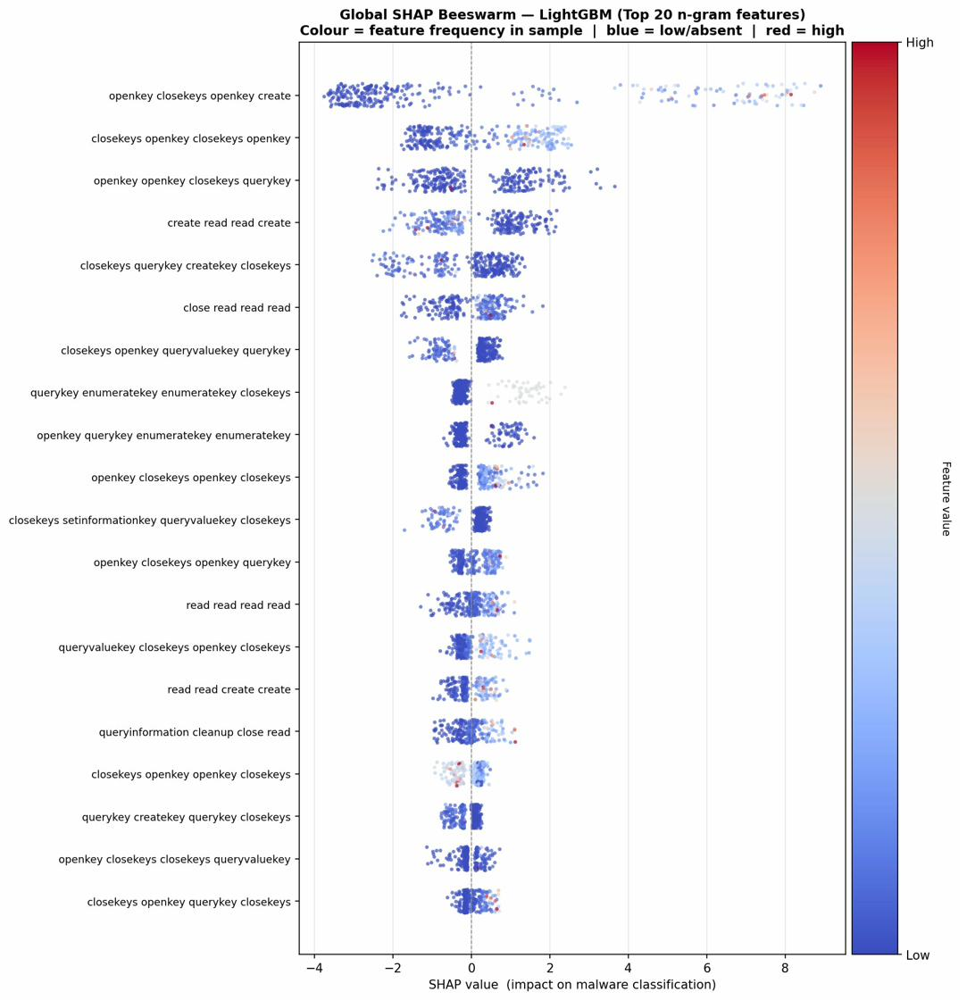
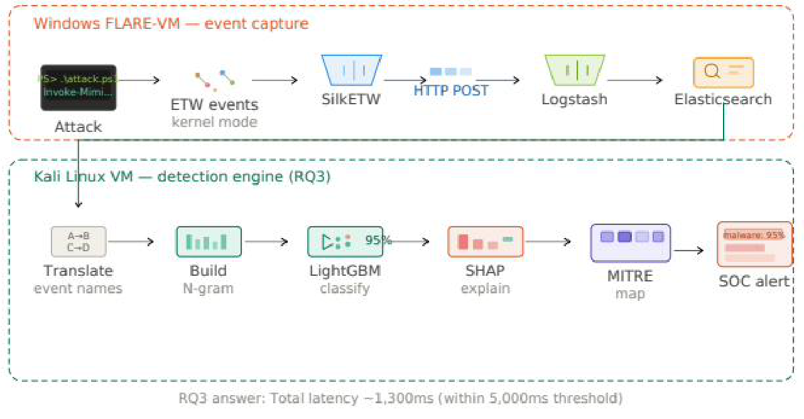

# Explainable AI for Graph-Based Fileless Malware Detection: Interpreting Graphite N-gram Decisions

MSc Cybersecurity thesis, Munster Technological University, Cork 

This repository holds the code, trained models and results for my MSc thesis. It builds on the Graphite framework (Wakodikar et al., SecureComm 2024) and adds four things to it: a comparison of four classifiers, a check of how faithful the SHAP and LIME explanations really are, a live SOC detection pipeline, and latency measurements for that pipeline.

The main finding is what I have called a feature-representation ceiling. Nine samples are misclassified by all four classifiers, even though those classifiers are built in very different ways. When models that different all fail on the same samples, the fault is not in any one model, it is in the N-gram embedding they all rely on.

## Architecture

The original Graphite pipeline (stages 1 to 5) is extended with an XAI explanation layer
using SHAP, MITRE ATT&CK technique mapping, and SOC alert generation. The lower portion
is the contribution of this thesis.



---

## Research questions

| RQ  | Question                                             | Main script                                   |
|-----|------------------------------------------------------|-----------------------------------------------|
| RQ1 | How do modern classifiers compare on the Graphite embedding? | `RQ1/comparative_analysis.py` |
| RQ2 | Which XAI method (SHAP vs LIME) explains those decisions more faithfully? | `RQ2/xai_faithfulness_analysis.py`, `RQ2/lightgbm_shap_analyzer.py` |
| RQ3 | Can the model run as a live SOC detector on streamed ETW events? | `RQ3&4/live_soc_simulation.py` |
| RQ4 | What is the end-to-end detection and explanation latency? | `RQ3&4/live_soc_simulation.py` |

Headline result: LightGBM reaches 91.81% accuracy and 91.30% F1 (a 3.99 point F1 gain
over the Random Forest baseline). SHAP won all twelve faithfulness comparisons.

Each research-question folder has its own README with detailed run instructions.

---

## Repository layout

```
Graphite_Project/
├── README.md
├── requirements.txt
│
├── core/                          # shared modules used by RQ1 and RQ2
│   ├── README.md
│   ├── main.py
│   ├── graphite_n_gram.py
│   ├── dataprocessor_graphs.py
│   └── parameter_parser.py
│
├── dataset/
│   ├── train/{benign, malware}/
│   ├── test/{benign, malware}/
│   ├── EventName_EdgeFeatures.json
│   └── NodeType_NodeFeatures.json
│
├── RQ1/
│   ├── README.md
│   ├── comparative_analysis.py
│   └── results/                   # metrics JSON, overlap JSON, comparison figures
│
├── RQ2/
│   ├── README.md
│   ├── xai_faithfulness_analysis.py
│   ├── lightgbm_shap_analyzer.py
│   └── results_rq2/               # faithfulness JSON and figures
│
├── RQ3&4/
│   ├── README.md
│   ├── live_soc_simulation.py     # detection engine (SilkETW translation tables are inside this file)
│   ├── logstash_pipeline_example.conf
│   ├── saved_model/               # lightgbm_model.joblib, graphite_embedder.joblib, model_meta.json
│   └── rq3&4_results/             # live detection results
│
└── docs/
    └── figures/                   # diagrams used in this README
```

The three modules in `core/` are shared, so they are kept in one place rather than
duplicated per research question. The RQ1 and RQ2 scripts import them.

---

## Setup

```bash
python3 -m venv .venv
source .venv/bin/activate        # Windows: .venv\Scripts\activate
pip install -r requirements.txt
```

The RQ1 and RQ2 scripts live in subfolders and import the shared modules from `core/`.
So Python can find them, add the two lines below at the top of each RQ script (above the
`from parameter_parser import ...` line):

```python
import sys, os
sys.path.insert(0, os.path.join(os.path.dirname(__file__), "..", "core"))
```

Alternatively, run without editing anything by putting `core` on the path for the command:

```bash
PYTHONPATH=./core python RQ1/comparative_analysis.py ...
```

The RQ1 and RQ2 commands below are run from the repository root.

---

## Offline pipeline (RQ1 and RQ2)

The offline experiments share one embedding. RQ1 trains and compares four classifiers on
that embedding; RQ2 applies SHAP and LIME independently to the trained models, masks the
top-K features, and compares the confidence drops to decide which explainer is more
faithful.



### RQ1: Classifier comparison

Compares Random Forest (baseline), XGBoost, LightGBM, and MLP on the shared Graphite
embedding, and records the misclassification overlap that underpins the
feature-representation ceiling.

```bash
python RQ1/comparative_analysis.py \
    --dataset-path dataset \
    --classifier all \
    --output-dir RQ1/results
```

Results are written to `RQ1/results/` (metrics, misclassification overlap, and the
comparison figures).

LightGBM leads on cross-validated F1, holds the strongest ROC-AUC, and keeps a low false
positive rate, which matters most for SOC deployment.







### RQ2: XAI faithfulness (SHAP vs LIME)

Applies SHAP and LIME to all four classifiers, masks the top-K features, and measures the
resulting confidence drop to judge which method more faithfully reflects each model.

```bash
python RQ2/xai_faithfulness_analysis.py --dataset-path dataset --k-values 3 5 10
```

Reproduce the analysis of the consensus-failure samples (the nine that every model gets
wrong):

```bash
python RQ2/xai_faithfulness_analysis.py --dataset-path dataset --sample-mode wrong --wrong-consensus all
```

LightGBM plus SHAP deep dive (trains and saves the model on first run, loads it on later
runs):

```bash
python RQ2/lightgbm_shap_analyzer.py --dataset-path dataset
```

Results are written to `RQ2/results_rq2/` (the faithfulness JSON and the SHAP and LIME
figures). `lightgbm_shap_analyzer.py` also trains and saves the model that the live
pipeline uses (see below).

Masking SHAP-ranked features causes a much larger confidence drop than masking
LIME-ranked features across every classifier and every value of K, so SHAP is the more
faithful explainer here. LIME stays near flat because it is structurally unsuited to the
correlated N-gram features.






---

## Live pipeline (RQ3 and RQ4)

The live detector consumes ETW events through the pipeline
SilkETW to Logstash to Elasticsearch, then scores each process graph and explains the
alert with SHAP. Latency is scoped to detection plus explanation once events reach
Elasticsearch, and stays well inside the 5,000 ms budget.



Run from inside the folder (the name contains an `&`, so quote it):

```bash
cd "RQ3&4"
python live_soc_simulation.py --trigger-nodes 200 --dashboard --watch-pid 5380
```

The optional dashboard then serves at `http://localhost:8050`, and results are written to
`RQ3&4/rq3&4_results/`.

Running the live mode end to end requires a full capture environment (SilkETW on a Windows
victim host, Logstash, and a reachable Elasticsearch index), so it is not reproducible from
the repository alone. The engine also has a `--dataset-test` mode that runs on the real
dataset graphlets with no capture stack, which is the reproducible way to check detection
and latency. See `RQ3&4/README.md` for all three run modes and the required SilkETW capture
flags. The SilkETW to Graphite event-name translation is defined inside
`live_soc_simulation.py`, and the model in `saved_model/` matches the one used for the
reported results.

---

## Citation

This work extends the original Graphite framework:

> Priti Wakodikar, Joon-Young Gwak, Meng Wang, Guanhua Yan, Xiaokui Shu, Scott Stoller,
> Ping Yang. *Graphite: Real-Time Graph-Based Detection of Windows Fileless Malware
> Attacks.* SecureComm 2024, LNICST 629, Springer, 2026.
> DOI: 10.1007/978-3-031-94455-0_8
